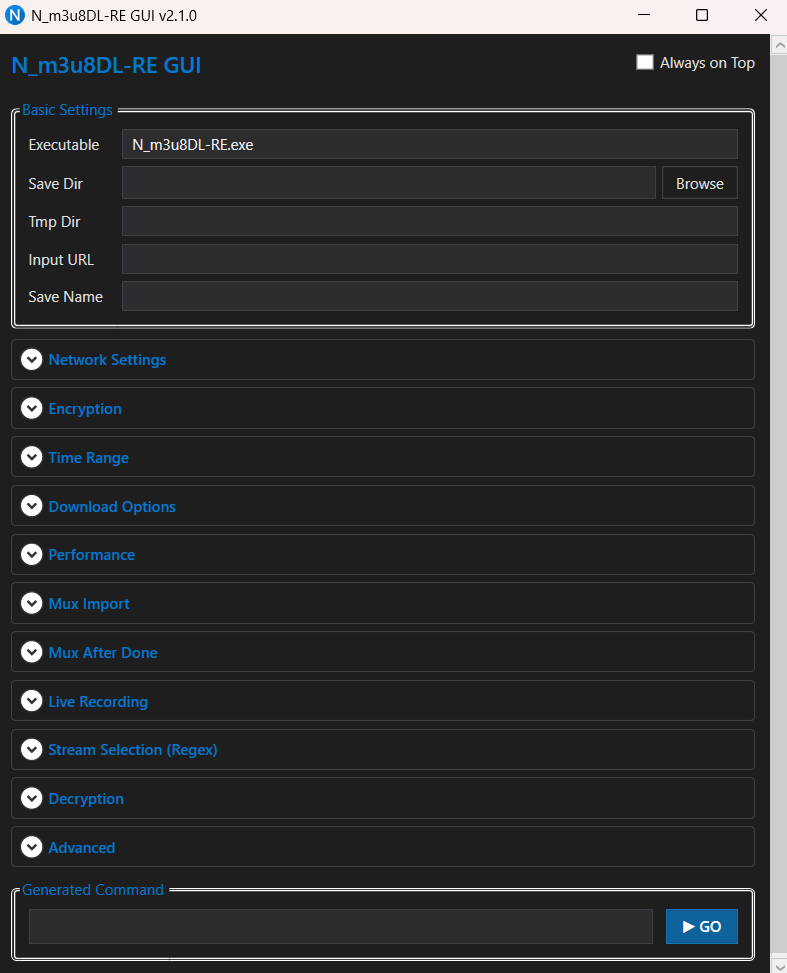

<!-- Improved compatibility of back to top link: See: https://github.com/othneildrew/Best-README-Template/pull/73 -->

<a id="readme-top"></a>

<!-- PROJECT SHIELDS -->

[![.NET][dotnet-shield]][dotnet-url]
[![WPF][wpf-shield]][wpf-url]
[![C#][csharp-shield]][csharp-url]
[![License][license-shield]][license-url]

<!-- PROJECT LOGO -->
<br />
<div align="center">
  <a href="https://github.com/naravid19/N_m3u8DL_RE_GUI">
    
  </a>

  <h3 align="center">N_m3u8DL-RE GUI</h3>

  <p align="center">
    A modern, user-friendly Windows GUI wrapper for the powerful N_m3u8DL-RE CLI tool.
    <br />
    <a href="https://github.com/nilaoda/N_m3u8DL-RE"><strong>View Original CLI Tool</strong></a>
    <br />
    <br />
    <a href="#usage">View Demo</a>
    |
    <a href="https://github.com/naravid19/N_m3u8DL_RE_GUI/issues/new?labels=bug">Report Bug</a>
    |
    <a href="https://github.com/naravid19/N_m3u8DL_RE_GUI/issues/new?labels=enhancement">Request Feature</a>
  </p>
</div>

<!-- TABLE OF CONTENTS -->
<details>
  <summary>Table of Contents</summary>
  <ol>
    <li>
      <a href="#about-the-project">About The Project</a>
      <ul>
        <li><a href="#built-with">Built With</a></li>
      </ul>
    </li>
    <li>
      <a href="#getting-started">Getting Started</a>
      <ul>
        <li><a href="#prerequisites">Prerequisites</a></li>
        <li><a href="#installation">Installation</a></li>
      </ul>
    </li>
    <li><a href="#usage">Usage</a></li>
    <li><a href="#features">Features</a></li>
    <li><a href="#roadmap">Roadmap</a></li>
    <li><a href="#contributing">Contributing</a></li>
    <li><a href="#license">License</a></li>
    <li><a href="#contact">Contact</a></li>
    <li><a href="#acknowledgments">Acknowledgments</a></li>
  </ol>
</details>

<!-- ABOUT THE PROJECT -->

## About The Project

<div align="center">
  
</div>

**N_m3u8DL-RE GUI** provides a graphical interface for the [N_m3u8DL-RE](https://github.com/nilaoda/N_m3u8DL-RE) command-line tool, making it easier to download DASH, HLS, and MSS streams without memorizing complex command-line arguments.

Main benefits:

- **No command-line memorization** - Common options are available through UI controls
- **Batch processing** - Download multiple streams from text files or folders with one click
- **Configuration persistence** - Your settings are automatically saved between sessions

<p align="right">(<a href="#readme-top">back to top</a>)</p>

### Built With

- [![.NET][dotnet-shield]][dotnet-url]
- [![WPF][wpf-shield]][wpf-url]
- [![C#][csharp-shield]][csharp-url]

<p align="right">(<a href="#readme-top">back to top</a>)</p>

<!-- GETTING STARTED -->

## Getting Started

This section explains how to set up and run the application locally as an end user.

### Prerequisites

Before using this application, ensure you have the following:

- **N_m3u8DL-RE** - The core download engine
  ```sh
  # Download from: https://github.com/nilaoda/N_m3u8DL-RE/releases
  ```
- **FFmpeg** - Required for muxing and processing
  ```sh
  # Download from: https://ffmpeg.org/download.html
  ```

### Installation

1. Download the latest release of N_m3u8DL-RE GUI.
2. Extract the archive to your preferred location.
3. Place required executables in the same directory:
   ```text
   N_m3u8DL_RE_GUI/
   |- N_m3u8DL_RE_GUI.exe
   |- N_m3u8DL-RE.exe      <- Required
   |- ffmpeg.exe           <- Optional, for muxing
   ```
4. Launch `N_m3u8DL_RE_GUI.exe`.

<p align="right">(<a href="#readme-top">back to top</a>)</p>

<!-- USAGE EXAMPLES -->

## Usage

### Quick Start

1. **Enter URL** - Paste your `.m3u8`, `.mpd`, or stream URL in the URL field
2. **Configure Options** - Select desired options (Audio Only, Sub Only, etc.)
3. **Click GO** - The application generates and executes the command

### Input Methods

| Method      | Description                           |
| ----------- | ------------------------------------- |
| Direct URL  | Paste a stream URL directly           |
| Drag & Drop | Drag `.m3u8`, `.mpd`, or `.txt` files |
| Batch File  | Use a `.txt` file with multiple URLs  |
| Folder      | Drop a folder containing stream files |

### Custom Headers

Add custom headers in the Headers field using this format:

```
Cookie: your_cookie_value|User-Agent: Mozilla/5.0
```

For more examples, refer to the [N_m3u8DL-RE Documentation](https://github.com/nilaoda/N_m3u8DL-RE).

<p align="right">(<a href="#readme-top">back to top</a>)</p>

<!-- FEATURES -->

## Features

### Core Features

- **Intuitive Interface** - Easy-to-use graphical interface for major options
- **Full RE Support** - Compatible with N_m3u8DL-RE command-line arguments
- **Batch Downloads** - Process multiple URLs from text files or folders
- **Config Persistence** - Settings saved automatically between sessions
- **Collapsible Sections** - Reduce clutter while keeping advanced controls available

### Stability and Quality

- **Safe Config Handling** - Backward-compatible `config.txt` parsing with safe fallbacks
- **Deterministic Tests** - Cross-machine stable unit tests for args/config/parser/batch services
- **Batch Service Layer** - Batch script generation moved out of heavy UI event code
- **Safe Startup Validation** - Null-safe validation refresh at startup
- **Windows-safe Argument Quoting** - Command arguments now safely handle trailing `\` paths and embedded quotes
- **Safer Batch Titles** - Batch `TITLE` lines are escaped for CMD context and directory mode uses predictable file-based titles
- **Safe Clipboard Access** - Clipboard-read failures are handled gracefully without crashing startup/UI flows

### Download Options

- **Concurrent Downloads** - Download multiple streams simultaneously
- **Audio/Subtitle Selection** - Download audio-only or subtitles-only
- **Stream Selection (Regex)** - Select/drop video/audio/subtitle streams by regex
- **Time Range** - Download specific portions of a stream
- **Speed Limit** - Set maximum download speed
- **Custom Proxy** - Support for HTTP and SOCKS5 proxies

### Muxing and Output

- **Mux After Done** - Automatically mux to mp4/mkv with ffmpeg or mkvmerge
- **Mux Import** - Import external media files during muxing
- **Subtitle Format** - Choose between SRT and VTT output

### Live Recording

- **Perform as VOD** - Treat live streams as VOD for full download
- **Realtime Merge** - Merge segments in real time
- **Pipe Mux** - Direct pipe to muxer
- **Record Limit** - Set maximum recording duration

### Decryption

- **Engine Selection** - MP4DECRYPT, SHAKA_PACKAGER, or FFMPEG
- **HLS Method Override** - Custom HLS decryption method
- **Real-Time Decryption** - Decrypt MP4 segments on the fly
- **Key Text File** - Load decryption keys from file

### Advanced Features

- **Custom Headers** - Add HTTP headers (Cookie, User-Agent, etc.)
- **Thread Control** - Customize thread count, retry count, and timeouts
- **Auto Subtitle Fix** - Automatically fix subtitle synchronization issues
- **Save Pattern** - Custom naming pattern for downloaded files
- **Log Level** - Control output verbosity (OFF/ERROR/WARN/INFO/DEBUG)
- **Readable Dropdowns** - High-contrast ComboBox dropdown list behavior

<p align="right">(<a href="#readme-top">back to top</a>)</p>

<!-- ROADMAP -->

## Roadmap

- [x] Full N_m3u8DL-RE argument support
- [x] Batch download from text files
- [x] UTF-8 batch file encoding
- [x] Multi-language UI (EN/CN/TW)
- [x] Dark theme with collapsible sections
- [x] Mux After Done with format/muxer selection
- [x] Live recording options
- [x] Stream selection with regex
- [x] Decryption engine selection
- [x] Advanced settings (Log Level, Save Pattern, etc.)
- [x] Safe config parser and backward compatibility hardening
- [x] Batch generation moved to service layer
- [x] Encoding detector/parser/core hardening with automated tests
- [ ] Download progress visualization
- [ ] Queue management

See the [open issues](https://github.com/naravid19/N_m3u8DL_RE_GUI/issues) for a full list of proposed features and known issues.

<p align="right">(<a href="#readme-top">back to top</a>)</p>

<!-- CONTRIBUTING -->

## Contributing

Contributions are welcome. To contribute:

1. Fork the project
2. Create your feature branch (`git checkout -b feature/AmazingFeature`)
3. Commit your changes (`git commit -m 'Add some AmazingFeature'`)
4. Push to the branch (`git push origin feature/AmazingFeature`)
5. Open a Pull Request

<p align="right">(<a href="#readme-top">back to top</a>)</p>

<!-- LICENSE -->

## License

Distributed under the MIT License. See `LICENSE.txt` for more information.

<p align="right">(<a href="#readme-top">back to top</a>)</p>

<!-- CONTACT -->

## Contact

Project Link: [https://github.com/naravid19/N_m3u8DL_RE_GUI](https://github.com/naravid19/N_m3u8DL_RE_GUI)

<p align="right">(<a href="#readme-top">back to top</a>)</p>

<!-- ACKNOWLEDGMENTS -->

## Acknowledgments

- [N_m3u8DL-RE](https://github.com/nilaoda/N_m3u8DL-RE) by nilaoda
- [FFmpeg](https://ffmpeg.org/)
- [Best-README-Template](https://github.com/othneildrew/Best-README-Template)
- [Img Shields](https://shields.io)

<p align="right">(<a href="#readme-top">back to top</a>)</p>

---

## Disclaimer

This application is a **GUI wrapper only**. All downloading and processing is handled by [N_m3u8DL-RE](https://github.com/nilaoda/N_m3u8DL-RE) and [FFmpeg](https://ffmpeg.org/). For issues related to downloading or media processing, refer to their respective repositories.

<!-- MARKDOWN LINKS & IMAGES -->
<!-- https://www.markdownguide.org/basic-syntax/#reference-style-links -->

[dotnet-shield]: https://img.shields.io/badge/.NET-9.0-512BD4?style=for-the-badge&logo=dotnet&logoColor=white
[dotnet-url]: https://dotnet.microsoft.com/
[wpf-shield]: https://img.shields.io/badge/WPF-Windows-0078D6?style=for-the-badge&logo=windows&logoColor=white
[wpf-url]: https://docs.microsoft.com/en-us/dotnet/desktop/wpf/
[csharp-shield]: https://img.shields.io/badge/C%23-12.0-239120?style=for-the-badge&logo=csharp&logoColor=white
[csharp-url]: https://docs.microsoft.com/en-us/dotnet/csharp/
[license-shield]: https://img.shields.io/badge/License-MIT-green?style=for-the-badge
[license-url]: LICENSE.txt
[product-screenshot]: images/screenshot.png
