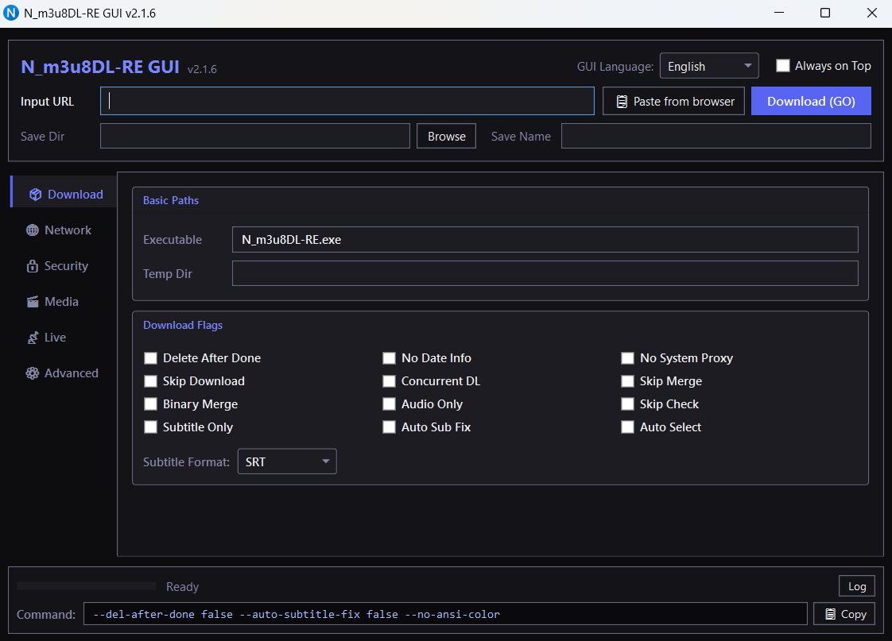

<!-- Improved compatibility of back to top link: See: https://github.com/othneildrew/Best-README-Template/pull/73 -->

<a id="readme-top"></a>

**English** | [简体中文](README.zh-CN.md)

<!-- PROJECT SHIELDS -->

[![Version][version-shield]][version-url]
[![.NET][dotnet-shield]][dotnet-url]
[![WPF][wpf-shield]][wpf-url]
[![C#][csharp-shield]][csharp-url]
[![License][license-shield]][license-url]

<!-- PROJECT LOGO -->
<br />
<div align="center">
  <a href="https://github.com/naravid19/N_m3u8DL_RE_GUI">
    
  </a>

  <h3 align="center">N_m3u8DL-RE GUI</h3>

  <p align="center">
    A modern, user-friendly Windows GUI wrapper for the powerful N_m3u8DL-RE CLI tool.
    <br />
    <a href="https://github.com/nilaoda/N_m3u8DL-RE"><strong>View Original CLI Tool</strong></a>
    <br />
    <br />
    <a href="#getting-started">Getting Started</a>
    ·
    <a href="https://github.com/naravid19/N_m3u8DL_RE_GUI/issues/new?labels=bug">Report Bug</a>
    ·
    <a href="https://github.com/naravid19/N_m3u8DL_RE_GUI/issues/new?labels=enhancement">Request Feature</a>
  </p>
</div>

<!-- ABOUT THE PROJECT -->

## About The Project

<div align="center">
  
</div>

**N_m3u8DL-RE GUI** provides a graphical interface for the [N_m3u8DL-RE](https://github.com/nilaoda/N_m3u8DL-RE) command-line tool. It makes downloading DASH, HLS, and MSS streams incredibly easy—no need to memorize complex command-line arguments anymore!

### Main Benefits:

- 🚀 **No command-line memorization** - Common options are available through simple UI controls.
- ⏯️ **Resume Interrupted Downloads** - Automatically detects stopped or crashed downloads with existing segments on disk. Seamlessly attach a fresh stream link (since signed URLs expire quickly) and resume without losing previously downloaded chunks.
- 🎬 **Native Abyss & Hydrax Support** - Direct AES-CTR chunk decryption and assembly for `abysscdn.com`, `playhydrax.com`, `zplayer.io`, and `short.ink` without external tools, with a picker when a video offers several qualities.
- 🌏 **Speaks Your Language** - The whole interface, status messages included, switches instantly between English, 简体中文, and 繁體中文.
- 📦 **Batch processing** - Download multiple streams from text files or folders with one click.
- 🔒 **Privacy First** - Your settings and headers are automatically saved between sessions and heavily encrypted using Windows DPAPI.
- 🛡️ **Cloudflare WAF Bypass** - Built-in TLS fingerprint impersonation to bypass Cloudflare security seamlessly.

<p align="right">(<a href="#readme-top">back to top</a>)</p>

---

<!-- GETTING STARTED -->

<a id="getting-started"></a>

## Getting Started (Installation)

We have intentionally kept the installation process as simple as possible. No installers, no complicated setups.

### 1. Download

Download the latest release (`N_m3u8DL_RE_GUI_v2.1.6.zip`) from our [GitHub Releases](https://github.com/naravid19/N_m3u8DL_RE_GUI/releases) page.

### 2. Extract

Extract the `.zip` file anywhere on your computer. Inside the folder, you will find 4 core files plus the optional companion browser extension:

```text
N_m3u8DL_RE_GUI_v2.1.6/
├── N_m3u8DL_RE_GUI.exe    <-- The main application (Double click this!)
├── N_m3u8DL-RE.exe        <-- The core download engine
├── ffmpeg.exe             <-- The video/audio muxing engine
├── m3u8_cf_bypass.py      <-- The Cloudflare TLS bypass script
└── extension/             <-- Optional browser companion (see below)
```

### 3. Run

Simply double-click `N_m3u8DL_RE_GUI.exe` to launch the application.

> [!NOTE]
> **Python Requirement:** If you plan to use the **Cloudflare Bypass** feature, make sure you have Python installed on your Windows machine, and run `pip install curl_cffi` in your command prompt.

<p align="right">(<a href="#readme-top">back to top</a>)</p>

---

<!-- USAGE -->

## Usage Guide

### Quick Start

1. **Enter URL** - Paste your `.m3u8`, `.mpd`, or stream URL in the top URL field.
2. **Configure Options** - Select desired options from the sidebar tabs (e.g., Audio Only, Sub Only).
3. **Click GO** - The application will automatically generate the CLI command and start downloading.

### Input Methods Supported

| Method      | How to use                            |
| ----------- | ------------------------------------- |
| ⬇ 1-Click Download | Click **⬇ Download** in the Browser Extension to automatically queue and start downloads in the GUI over Native Messaging. |
| 📋 Paste from Browser | Copy a request as cURL from browser DevTools (F12) or click **Copy as cURL** in the Browser Extension, then click **📋 Paste from browser**. |
| 🗂️ HAR Capture Drop | Drag a `.har` network capture onto the GUI. If multiple streams are found, an interactive picker window lets you select the master stream. |
| 🎬 Abyss / Hydrax | Paste `abysscdn.com/?v=...`, `playhydrax.com/?v=...`, `zplayer.io/?v=...`, or `short.ink/...` directly. The GUI fetches the available qualities and downloads chunks natively. When more than one quality is offered you pick one (largest listed first); a download started by the browser extension takes the largest automatically. |
| Direct URL  | Paste a standard `.m3u8`, `.mpd`, or `.mp4` stream URL directly into the top bar. |
| Drag & Drop | Drag `.m3u8`, `.mpd`, or `.txt` files directly into the window. |
| Batch File  | Drop a `.txt` file containing multiple URLs (one per line). |
| Folder      | Drop a folder containing stream files to batch process them all. |

### N-RE Stream Bridge Browser Extension (v1.4.5)

Use the companion browser extension **N-RE Stream Bridge** in `extension/` for 1-click stream capture, quality selection, and multi-URL batch queues in Chrome, Edge, and Brave:
1. Open `chrome://extensions` and enable **Developer mode**.
2. Click **Load unpacked** and select the `extension/` folder.
3. Play any video or audio in your browser → click the extension icon.
4. **Single Stream:** Click **`▸ Qualities`** to pick your resolution (1080p, 720p, etc.) → **`⬇ Download`** (or **`📋 Copy as cURL`**).
5. **Batch Streams:** Check multiple stream rows → click **`📋 Copy as list`**.
6. In the GUI, click **`📋 Paste from browser`** (or Ctrl+V) → All stream URLs, headers, and quality selectors are filled instantly!

> [!TIP]
> **1-click download:** once the GUI has been run at least once, the popup shows a **`⬇ Download`** button beside `📋 Copy as cURL`. It hands the stream — URL, headers, merged cookies, and the selected quality — straight to the GUI and starts the download, with no copy-paste and no window switching. Click it while a download is already running and the stream simply queues behind it.

> [!NOTE]
> **Stream Coverage & Privacy:** Supports **HLS** (`.m3u8`), **DASH** (`.mpd`), **Smooth Streaming** (`.ism`/`/Manifest`), **Abyss/Hydrax**, standalone audio (`.m4a`, `.opus`, `.flac`, `.wav`, `.aac`, `.mp3`), and progressive formats (`.mp4`, `.m4v`, `.webm`, `.mkv`, etc.). Automatically suppresses segment flooding to keep manifests visible, shows live file sizes and confidence badges, probes stream renditions strictly on demand, and uses memory-backed `chrome.storage.session` so sensitive cookies are never written unencrypted to disk.

### How to use Cloudflare Bypass

If a website is blocking you with Cloudflare, open the **Network tab (🌐)** and find the **⚡ Cloudflare Bypass (curl_cffi)** section:
1. Tick **Enable Cloudflare Bypass**.
2. Choose your bypass **Engine**:
   - **Auto (Recommended)** - Downloads plain HLS directly via multi-threaded `curl_cffi`, and spins up the local proxy server for DASH/MSS/CENC streams. If a direct HLS download finds something it cannot assemble (fMP4 init segments, separate audio tracks, byte-range segments), it hands the job to the proxy engine by itself.
   - **CF Direct (HLS only)** - Directly downloads and merges plain HLS streams using concurrent worker threads. It refuses fMP4 / separate-audio / byte-range playlists instead of writing a broken file; use *Auto* or *Proxy* for those.
   - **CF Proxy + RE (DASH / MSS / DRM)** - Starts a local `--serve` ephemeral proxy server (`127.0.0.1:0`) with token authentication and SSRF protection to rewrite manifests and forward requests to N_m3u8DL-RE. A custom or system proxy is not applied on this path, because N_m3u8DL-RE only talks to the local proxy.
3. Select a browser fingerprint (e.g., `chrome131`, `chrome120`, `edge101`, `safari17_0`).
4. Enter `Referer` or `CF Cookie` if needed — or simply click **📋 Paste from browser** to populate them automatically from the extension.
5. Click **▶ GO**.

> [!TIP]
> **Credential Privacy:** The parameters preview bar shows the real command, credentials included, so that **📋 Copy** gives you something you can paste into a terminal and run as-is. A cookie you paste is therefore visible on screen — worth knowing before you share a screenshot or a recording. Once a Cloudflare-bypass download starts, the bar is replaced by a masked snapshot of that command (`--cookie "...(masked, 412 chars)"`) for the rest of the run, while the launched process receives the full value.

> [!TIP]
> **Resuming a Stopped Download:** If a Cloudflare-bypass download is stopped or fails partway through, just paste the same URL and Save Name and click **▶ GO** again — segments already saved to disk are detected and skipped, so the download continues instead of restarting from 0%.

<p align="right">(<a href="#readme-top">back to top</a>)</p>

---

<!-- FEATURES -->

## Detailed Features

### Core Features
- **Universal Stream Capture** - 1-click **⬇ Download** over Native Messaging, paste browser cURL commands directly, drag-and-drop `.har` captures with automated stream ranking and picking, or use the **N-RE Stream Bridge** browser extension. Every capture starts clean: the decryption key, Cloudflare bypass, and TLS profile are reset, so nothing carries over from the previous stream; your own proxy setting is kept.
- **Resume Interrupted Downloads** - Automatically derives deterministic temp directories (`<saveDir>/.nre-tmp/<saveName>`) and persists active job metadata. On startup, detects unfinished downloads with saved segments, offers a 1-click resume workflow with a fresh stream link, or clean discards.
- **Native Abyss / Hydrax Downloader** - Built-in zero-dependency C# crypto engine that decrypts and reassembles fragmented chunks from `abysscdn.com`, `playhydrax.com`, `zplayer.io`, and `short.ink`. Verifies chunk sizes on disk and resumes a stopped or interrupted download from its exact byte offset instead of restarting, with honest cancellation reporting and accurate live progress tracking. Videos offered in several qualities open a quality picker (largest first).
- **Hardened Cloudflare WAF Bypass** - Multi-threaded segment downloader (`curl_cffi`), browser fingerprint impersonation, manifest rewriter & proxy mode (`--serve`) for DASH/MSS/DRM streams, honest exit code handling, and automatic segment resume from a deterministic per-download job directory (re-running the same URL and Save Name skips segments already on disk).
- **3-Zone Modern UX/UI Architecture** - Clean layout with a top URL hero bar, a 6-Tab sidebar (`📦 Download`, `🌐 Network`, `🔒 Security`, `🎬 Media`, `📡 Live`, `⚙️ Advanced`), and a fixed command preview bar at the bottom.
- **GUI Auto-Update Engine** - Zero rate-limit HTTP update checker. If a new version is released, a green pill badge (`🎉 vX.X.X Available!`) will appear at the top.
- **Multi-Language Interface** - English, 简体中文, and 繁體中文, switched live from the header with no restart. Labels, dialogs, status messages, the resume banner, and update status are all translated; the technical log stays in English. The language follows your Windows display language on first launch.
- **Full RE Support** - Compatible with all major N_m3u8DL-RE command-line arguments.
- **Batch Downloads** - Process multiple URLs from text files or drop entire folders of streams.
- **Config Persistence** - Settings are saved automatically between sessions.

### Security and Stability
- **Windows DPAPI Secret Protection** - Your custom headers, proxies, decryption keys, and IVs are safely encrypted via Windows DPAPI in your `config.json` file. No plaintext secrets!
- **Credential Privacy on Resume** - Resume job records intentionally store only the source hostname (never raw stream URLs or signed access tokens). A running Cloudflare-bypass download also replaces the parameters preview with a cookie-masked snapshot of its command; the live preview itself stays verbatim so **📋 Copy** remains copy-and-run.
- **Thread-Safe Cancellation** - Responsive process cancellation with clean token lifetime management that safely terminates child process trees.
- **In-Window Live Feedback & Progress** - Real-time progress bar, live status messages with color-coded alerts (green success, amber warnings/partials, red errors), collapsible diagnostic log, and an "Open Folder" button on completion.
- **Accessible & Keyboard Ready** - High-contrast focus visual indicators, access keys (`Alt+G` for Go, `Alt+S` / `Escape` for Stop), and full UI automation properties.
- **Automated Test Suite (1,336 Tests)** - Rock-solid stability backed by 1,336 unit, integration, parity, and accessibility tests across .NET (892 tests, 1 live-network test intentionally skipped), Node.js (361 tests), and Python (83 tests) test suites.

### Download Options
- **Concurrent Downloads** - Download multiple streams simultaneously.
- **Audio/Subtitle Selection** - Download audio-only or subtitles-only easily.
- **Stream Selection (Regex)** - Select or drop video/audio/subtitle streams by standard regex.
- **Time Range** - Download specific portions of a stream (e.g., `00:05:00-00:10:00`).
- **Speed Limit** - Set a maximum download speed to avoid throttling.
- **Custom Proxy** - Support for HTTP and SOCKS5 proxies.

### Muxing and Output
- **Mux After Done** - Automatically mux video and audio to `.mp4` or `.mkv` with `ffmpeg`.
- **Mux Import** - Import external media files during muxing.
- **Subtitle Format** - Choose between SRT and VTT output formats.

### Live Recording
- **Perform as VOD** - Treat live streams as VOD, allowing full download and pausing.
- **Realtime Merge** - Merge segments in real time without waiting for completion.
- **Pipe Mux** - Direct pipe to muxer to save disk I/O.
- **Record Limit** - Set a maximum recording duration.

### Decryption
- **Engine Selection** - Choose between MP4DECRYPT, SHAKA_PACKAGER, or FFMPEG for real-time MP4 segment decryption.
- **HLS Method Override** - Set a custom HLS decryption method.
- **Key Text File** - Load a massive list of decryption keys directly from a file.

### Advanced Control
- **Custom Headers** - Add HTTP headers (Cookie, User-Agent, Origin, etc.).
- **Thread Control** - Customize thread count, retry limits, and timeout parameters.
- **Auto Subtitle Fix** - Automatically fix subtitle synchronization issues. Like *Delete After Done*, it is on by default in N_m3u8DL-RE, and unticking it really turns it off.
- **Save Pattern** - Custom naming pattern for downloaded files.
- **Log Level** - Control output verbosity (OFF/ERROR/WARN/INFO/DEBUG).

### Building a Release

To build the release folder and zip, run `publish.bat` from the repository root (add `/nopause` when calling it from another script). It reads the version from `Directory.Build.props`, publishes the app as a self-contained single file, adds `N_m3u8DL-RE.exe`, `ffmpeg.exe`, `m3u8_cf_bypass.py` and the `extension/` folder (without its tests), checks the result, and writes `Publish\N_m3u8DL_RE_GUI_v<version>\` together with `N_m3u8DL_RE_GUI_v<version>.zip`. `N_m3u8DL-RE.exe`, `ffmpeg.exe` and `m3u8_cf_bypass.py` must sit in the repository root; if one is missing it stops before building anything. Everything is assembled in `Publish\.staging` and moved into place only after every check passes, so a failed run never leaves a half-built release.

A complete release archive must contain: `N_m3u8DL_RE_GUI.exe`, `N_m3u8DL-RE.exe`, `ffmpeg.exe`, `m3u8_cf_bypass.py`, and the `extension/` folder. The version is `AppVersion` in `Directory.Build.props`, the only place it is typed; `publish.bat` checks that the built exe reports the same number, so the folder name, the zip name and the binary cannot drift apart.

<p align="right">(<a href="#readme-top">back to top</a>)</p>

---

<!-- ROADMAP -->

## Roadmap

- [x] Full N_m3u8DL-RE argument support
- [x] Batch download from text files
- [x] Multi-Language UI (English, 简体中文, 繁體中文) with live dynamic hot-switching
- [x] Dark theme with a Zone D status strip and a collapsible log panel
- [x] Stream selection with regex
- [x] Safe config parser and Windows DPAPI secret protection
- [x] GUI Auto-Update checking system
- [x] Download progress and live status visualization
- [x] Keyboard shortcuts, visible focus rings, and screen-reader names on every control
- [x] Full WCAG 2.1 AA contrast compliance and option-conflict dependency visibility
- [ ] Collapsible option groups and task-oriented grouping
- [ ] Queue management

<p align="right">(<a href="#readme-top">back to top</a>)</p>

---

<!-- LICENSE & DISCLAIMER -->

## Disclaimer

This application is a **GUI wrapper only**. All downloading and processing is handled by [N_m3u8DL-RE](https://github.com/nilaoda/N_m3u8DL-RE) and [FFmpeg](https://ffmpeg.org/). For issues related to downloading or media processing failures, please refer to their respective repositories.

## License

Distributed under the MIT License. See `LICENSE` for more information.

<!-- MARKDOWN LINKS & IMAGES -->
[version-shield]: https://img.shields.io/badge/version-2.1.6-blue?style=for-the-badge
[version-url]: CHANGELOG.md
[dotnet-shield]: https://img.shields.io/badge/.NET-9.0-512BD4?style=for-the-badge&logo=dotnet&logoColor=white
[dotnet-url]: https://dotnet.microsoft.com/
[wpf-shield]: https://img.shields.io/badge/WPF-Windows-0078D6?style=for-the-badge&logo=windows&logoColor=white
[wpf-url]: https://docs.microsoft.com/en-us/dotnet/desktop/wpf/
[csharp-shield]: https://img.shields.io/badge/C%23-13.0-239120?style=for-the-badge&logo=csharp&logoColor=white
[csharp-url]: https://docs.microsoft.com/en-us/dotnet/csharp/
[license-shield]: https://img.shields.io/badge/License-MIT-green?style=for-the-badge
[license-url]: LICENSE
[product-screenshot]: images/screenshot.png
